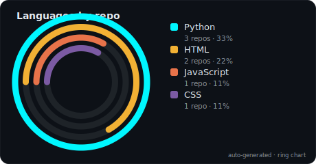

<h1 align="center">Hi, I'm Jeeven 👋</h1>

<h3 align="center">Game Technology Undergrad · Building "Escape The Debt" (Unity 6 URP) · Full-Stack Dev</h3>

  

---

### 🚀 About Me

- 🎓 Year 3 IT (Game Technology) student at **Universiti Teknikal Malaysia Melaka (UTeM)** — CGPA 3.56
- 🎮 Currently building **Escape The Debt** — a Unity 6 URP first-person serious game teaching Malaysian students how to manage debt (PTPTN, credit cards, BNPL)
- 🔬 Built and open-sourced **GEQ Toolkit** — a web questionnaire + analytics dashboard so any game dev can run standardized playtesting research
- 💼 Interned at **Top Glove Sdn. Bhd.**, building a Django-based internal QA system
- 🌐 Multilingual dev — Tamil, English, Bahasa Malaysia, Malayalam
- 🕹️ Big fan of Soulslike games and Subnautica (yes, this influences my game design)
- 🔍 **Open to internships June–December 2026**
- 📫 Reach me at **jeeven1604@gmail.com**

---

### 🛠️ Tech Stack

  
  
  
  
  
  
  
  
  
  
  
  

---

### 📌 Featured Projects

<table>
  <tr>
    <td width="50%">
      <h4>🎮 Escape The Debt (FYP)</h4>
      Unity 6 URP first-person serious game teaching debt management through escape-room puzzles (PTPTN, Credit Card Dungeon, BNPL Shopping Trap).
        
      
      
    </td>
    <td width="50%">
      <h4>📊 GEQ Toolkit</h4>
      Open-source Game Experience Questionnaire web app + researcher dashboard (6 chart types, zero backend). Any game can use it for playtesting research.
        
      
      
    </td>
  </tr>
  <tr>
    <td width="50%">
      <h4>💀 Universal Death Counter</h4>
      Open-source PySide6 desktop app for tracking in-game deaths across any title — built for the Soulslike/roguelike community.
        
      
    </td>
    <td width="50%">
      <h4>🌐 Portfolio Site</h4>
      Cyberpunk-themed personal site with a hidden terminal, RPG character sheet modal, and full project showcase.
        
      
    </td>
  </tr>
</table>

---

### 🗂️ Latest Repositories

<!-- REPOS:START -->
| Repo | Description | Language | Last push |
|---|---|---|---|
| 🐍 **[UniversalDeathCounter](https://github.com/Jvn1604/UniversalDeathCounter)** | a simple manual death counter | `Python` | 2026-07-08 |
| 🌐 **[escape-debt-dashboard](https://github.com/Jvn1604/escape-debt-dashboard)** | _No description yet._ | `JavaScript` | 2026-07-04 |
| 🌐 **[geq-toolkit](https://github.com/Jvn1604/geq-toolkit)** | _No description yet._ | `JavaScript` | 2026-07-04 |
| 🎨 **[Jvn1604.github.io](https://github.com/Jvn1604/Jvn1604.github.io)** | My portfolio | `CSS` | 2026-07-02 |
| 🐍 **[game-deals-scraper](https://github.com/Jvn1604/game-deals-scraper)** | _No description yet._ | `Python` | 2026-07-01 |
| 🌐 **[content-creator-assets-dataset](https://github.com/Jvn1604/content-creator-assets-dataset)** | A dataset of 50 content-creator broadcast assets — overlays, transitions, alerts, and font kits — with metadata, generated previews, and a browsable UI | `HTML` | 2026-07-01 |

🤖 Auto-updated 2026-07-14 · showing 6 most recently updated of 10 public repos
<!-- REPOS:END -->

---

### 📊 GitHub Stats

  
  

  

  

---

  <a href="https://jvn1604.github.io">🌐 Portfolio</a> ·
  <a href="mailto:jeeven1604@gmail.com">✉️ Email</a> ·
  <a href="https://www.linkedin.com/in/jeeventhiran-sivanantham-b5abb9261">💼 LinkedIn</a>

